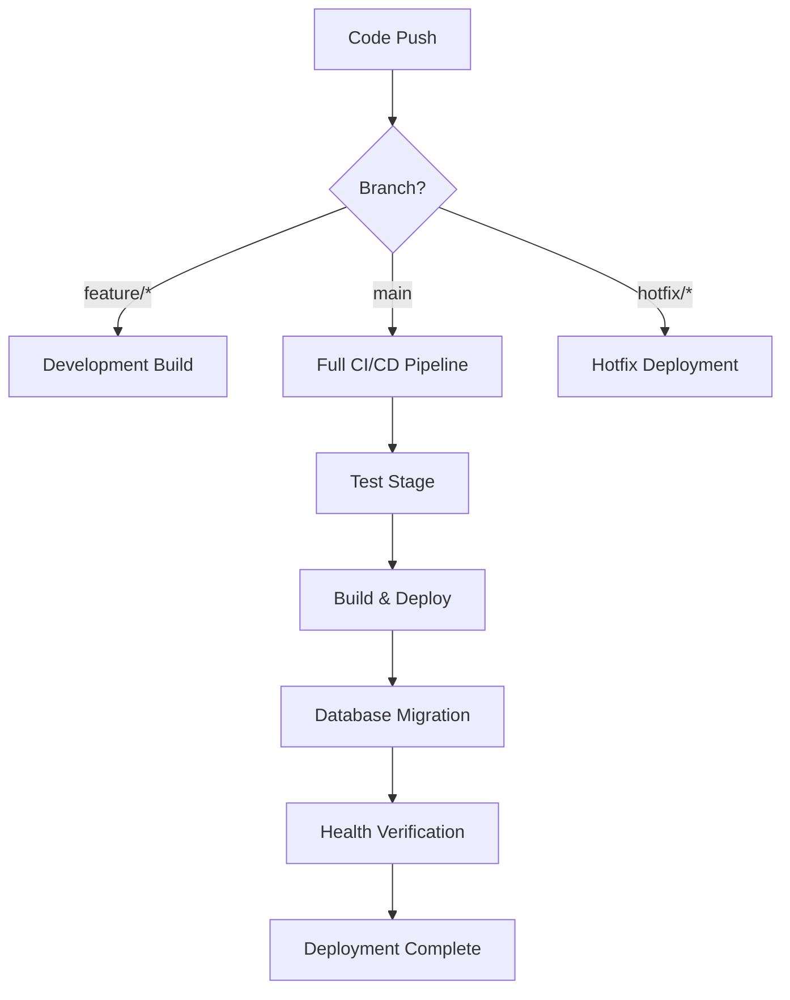

# Golf League Manager CI/CD Deployment Guide

## Overview

This document describes the complete CI/CD pipeline setup for the Golf League Manager application using GitHub Actions with a self-hosted runner.

## Pipeline Architecture



## Available Workflows

### 1. Main CI/CD Pipeline (`ci-cd.yml`)
- **Trigger**: Push to `main` branch
- **Process**: Test → Build → Deploy → Migrate → Verify
- **Environment**: Production

### 2. Development Build (`dev-build.yml`)
- **Trigger**: Push to `develop` or `feature/*` branches
- **Process**: Test → Build verification only
- **Purpose**: Validate code before merging

### 3. Hotfix Deployment (`hotfix.yml`)
- **Trigger**: Push to `hotfix/*` branches
- **Process**: Quick build → Backup → Deploy → Verify
- **Purpose**: Emergency fixes with minimal delay

### 4. Manual Deployment (`manual-deploy.yml`)
- **Trigger**: Manual via GitHub Actions UI
- **Options**: 
  - Environment selection
  - Skip tests for emergencies
  - Migration-only mode
- **Purpose**: Controlled deployments and testing

### 5. Emergency Rollback (`rollback.yml`)
- **Trigger**: Manual via GitHub Actions UI
- **Options**:
  - Quick rollback to latest backup
  - Specific backup selection
  - Backup creation only
- **Purpose**: Rapid recovery from deployment issues

### 6. Health Check (`health-check.yml`)
- **Trigger**: Scheduled every 6 hours + manual
- **Process**: System monitoring and resource checking
- **Purpose**: Proactive issue detection

## Deployment Scripts

### Core Scripts
- `verify-deployment.sh` - Comprehensive deployment verification
- `migrate-all-tenants.sh` - Multi-tenant database migrations
- `rollback-deployment.sh` - Emergency rollback capabilities
- `health-check.sh` - System health monitoring

### Health Endpoints
- `GET /api/health` - Basic health status
- `GET /api/health/detailed` - Detailed system information

## Deployment Process

### Standard Deployment (main branch)
1. **Code Push**: Developer pushes to main branch
2. **Test Stage**: Runs .NET and Angular tests
3. **Build Stage**: Creates Docker images
4. **Deploy Stage**: Stops old containers, starts new ones
5. **Migration Stage**: Runs database migrations for all tenants
6. **Verification Stage**: Health checks and endpoint testing

### Emergency Procedures

#### Quick Rollback
```bash
# Via script
./rollback-deployment.sh quick

# Via GitHub Actions
# Go to Actions → Emergency Rollback → Run workflow
# Select "quick" rollback type
```

#### Specific Rollback
```bash
# Via script
./rollback-deployment.sh rollback <backend_tag> <frontend_tag>

# Via GitHub Actions
# Select "specific" rollback type and provide backup tags
```

#### Manual Deployment
```bash
# Check deployment status
./verify-deployment.sh

# Manual migration only
# Use GitHub Actions Manual Deployment with migration_only option
```

## Configuration Requirements

### Self-Hosted Runner Setup
```bash
# Install Docker and Docker Compose
sudo apt update
sudo apt install docker.io docker-compose

# Add runner user to docker group
sudo usermod -aG docker $USER

# Configure runner with GitHub repository
# Follow GitHub's self-hosted runner setup guide
```

### Environment Variables
The workflows automatically set:
- `POSTGRES_USER=golfuser`
- `POSTGRES_PASSWORD=golfpassword`
- `POSTGRES_DB=golfdb`

### Network Configuration
Ensure these ports are accessible on the runner:
- `4500` - Frontend (Nginx)
- `5505` - Backend (.NET API)
- `5432` - PostgreSQL database

## Monitoring and Alerting

### Health Checks
- Automated every 6 hours
- Manual trigger available
- Monitors:
  - Container status
  - Service endpoints
  - Database connectivity
  - Resource usage
  - Error logs

### Backup Strategy
- Automatic backup before each deployment
- Tagged with timestamp
- Retention: Manual cleanup required
- Emergency backup creation available

## Troubleshooting

### Common Issues

#### Deployment Fails
1. Check container logs: `docker compose logs`
2. Verify database connectivity
3. Check disk space and resources
4. Review GitHub Actions logs

#### Health Check Fails
1. Verify all containers are running: `docker compose ps`
2. Check service endpoints manually
3. Review recent error logs
4. Check database connectivity

#### Migration Fails
1. Check database connection
2. Verify migration files
3. Check tenant database list
4. Review migration logs

### Recovery Procedures

#### Service Down
```bash
# Quick restart
docker compose restart

# Full rebuild
docker compose down
docker compose up -d --build
```

#### Database Issues
```bash
# Check database status
docker exec golfleague_postgres pg_isready -U golfuser

# Restart database
docker compose restart postgres

# Run migrations manually
./migrate-all-tenants.sh
```

#### Complete System Recovery
```bash
# Emergency backup
./rollback-deployment.sh backup

# Full system rollback
./rollback-deployment.sh quick

# Verify recovery
./verify-deployment.sh
```

## Best Practices

### Development Workflow
1. Create feature branches from `develop`
2. Verify builds pass on feature branches
3. Create PR to `main` for production deployment
4. Monitor deployment status
5. Verify health after deployment

### Emergency Procedures
1. Always create backup before rollback
2. Document the issue and resolution
3. Test thoroughly before next deployment
4. Update monitoring if new issues discovered

### Maintenance
1. Regular health check reviews
2. Cleanup old Docker images periodically
3. Monitor disk usage and log rotation
4. Update backup retention policies

## Security Considerations

### Access Control
- Self-hosted runner secured
- Database credentials managed
- Container network isolation
- Health endpoints are public (contain no sensitive data)

### Backup Security
- Backups stored locally on runner
- No sensitive data in backup tags
- Regular cleanup recommended

## Performance Optimization

### Build Performance
- Docker layer caching enabled
- npm cache configured
- .NET build cache utilized

### Deployment Speed
- Parallel container builds
- Efficient health checks
- Optimized verification scripts

### Resource Management
- Container resource limits
- Automatic cleanup of old images
- Scheduled health monitoring

This pipeline provides a robust, automated deployment system with comprehensive monitoring, rollback capabilities, and emergency procedures for the Golf League Manager application.
